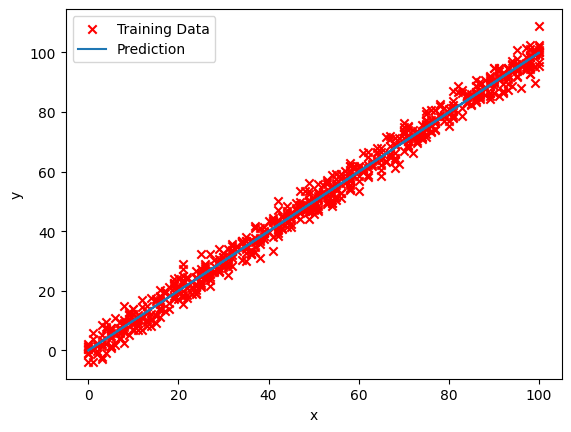
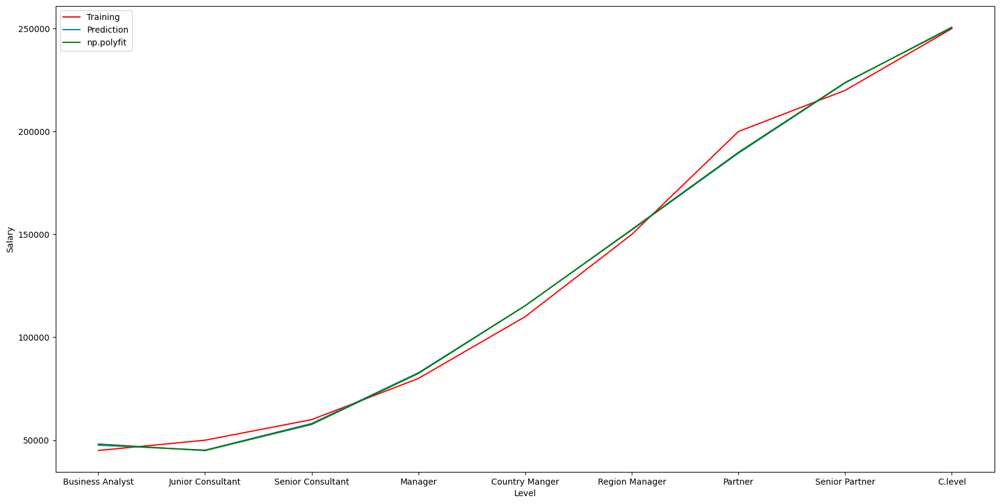
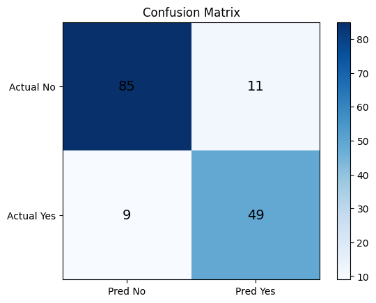
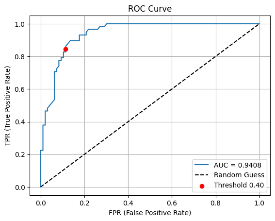
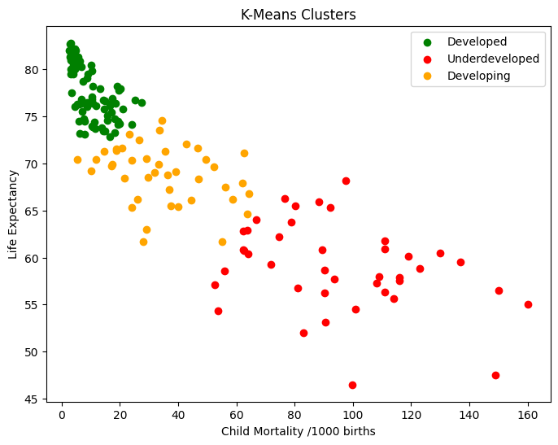
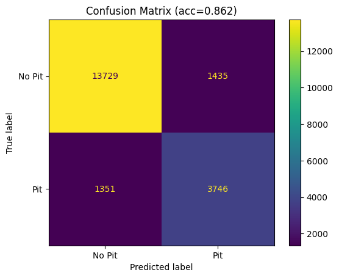
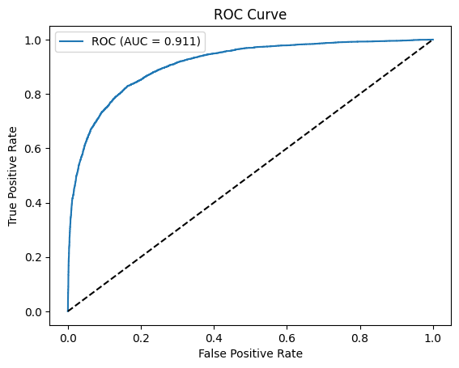
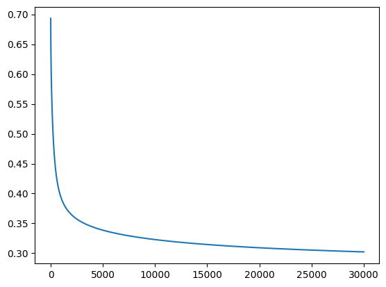

# Learning ML

> [!NOTE]
> Repository documenting my implementations of classical machine learning algorithms and experiments.

## Contents

### Fundamentals

- [Types of Data](./basic/TypesOfData.md)
- [Dataset](./basic/Dataset.md)
- [Handling Missing Values](./basic/HandlingMissingValues.md)
- [Outliers](./basic/Outlier.md)
- [Reinforcement Learning](./basic/Reinforcement%20Learning.md)

### Linear Regression

- [linear-reg.ipynb](./linear-reg/linear-reg.ipynb) - Implementation of linear regression with gradient descent
  - final results: w ≈ 0.999, b ≈ 0.015

  

### Polynomial Regression

- [polynomial-reg.ipynb](./poly-reg/polynomial-reg.ipynb) - Implementation of polynomial regression with gradient descent on salary data
  - Uses x, x², x³ features with normalization

  

### Logistic Regression

- [logistic-regression.ipynb](./logistic-reg/logistic-regression.ipynb) - Implementation of logistic regression for classification
  - Uses sigmoid function and binary cross-entropy loss

  
  

### KMeans Clustering

- [kmeans-clustering.ipynb](./kmeans-clustering/k-means-clustering.ipynb)
  Implementation of 2D KMeans to classify countries as Underdeveloped, Developing and Developed based on Life Expectance and Child Mortality

### F1 Pit Stop Prediction

- [f1-lap-data-analysis.ipynb](./f1-lap-analysis/f1-lap-data-analysis.ipynb) - Logistic regression to predict pit stops using F1 lap data (101k laps, 16 features)
  - GPU-accelerated with CuPy on T4
  - Custom gradient descent with weighted binary cross-entropy loss
  - Degree-2 polynomial features
  - One-hot encoded Driver (31) and Race (28) features
  - F1-optimal threshold sweep for imbalanced data
  - Standalone CLI tool for predictions ([pit_predict.py](./f1-lap-analysis/pit_predict.py))

  **Results:** 86% accuracy, 73% recall, 0.73 F1

  
  
  

### RL Pathfinding (Dynamic Gridworld)

- [rl-pathfinding.ipynb](./rl-pathfinding/rl-pathfinding.ipynb) - Pathfinding framed as reinforcement learning, from static value iteration to a moving obstacle. Full writeup in the [project README](./rl-pathfinding/README.md).
  - Value iteration in 2D/3D (essentially Dijkstra), then Q-learning + SARSA once the obstacle moves
  - Obstacle-aware vs blind ablation, Q-learning vs SARSA, results averaged across seeds with error bars
  - **Results:** SARSA ~7–9% crash rate vs Q-learning ~21% at the same path length; counterintuitively, the obstacle-blind agent (~11–13%) beat the obstacle-aware one (~21%)

## Sources

- [CodeChef ML Roadmap](https://www.codechef.com/roadmap/machine-learning-using-python)
- [Kaggle Learn](https://www.kaggle.com/learn)
