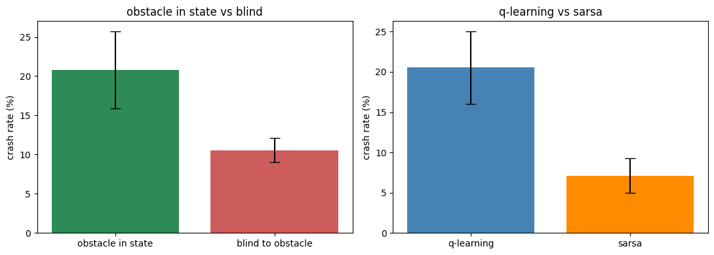
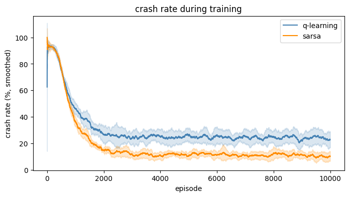

# RL Pathfinding in a Dynamic Gridworld

This project started from a simple observation about the Bellman equation looking almost identical to shortest-path recurrence relations. It turned into an exploration of when that equivalence actually holds, and what breaks when the environment stops being static.

## Motivation

Reading the Bellman equation, it’s hard not to notice how closely it matches classical shortest-path formulations. If you flip signs (treat cost as negative reward) and set the discount to 1, value iteration becomes structurally identical to something like Dijkstra or Bellman-Ford.

That raised a simple question: if the math is basically the same, what changes when you treat pathfinding as reinforcement learning instead of classical planning?

At first, not much. But the interesting part is where that stops being true.

## Project Overview

The implementation was built up in stages, mostly to see where the “RL as pathfinding” framing breaks down.

I started with a 2D gridworld using value iteration. As expected, it converges cleanly and produces optimal paths. But it’s really just Dijkstra in disguise.

A 3D version didn’t change much. It’s still a static environment, just larger state space and more actions.

Things only became interesting when I introduced a moving obstacle. Now the environment changes while the agent is acting, which makes precomputed shortest paths irrelevant. At that point I switched to Q-learning so the agent could learn a policy over state configurations instead of fixed routes.

There was also an early bug that mattered more than expected: the obstacle wasn’t actually part of the agent’s state. The agent had effectively learned a static shortest-path solution while the environment looked dynamic on the surface.

## Experiments and Results

Once fixed, the setup was used to compare a few things under the moving-obstacle setting.

The first comparison was whether the agent benefits from explicitly observing the obstacle. Surprisingly, it didn’t.

- Obstacle-aware agent: ~21% crash rate
- Blind agent: ~11–13% crash rate

Even after significantly increasing training for the obstacle-aware version, it didn’t catch up. In this small grid, extra information just made the learning problem harder without improving the policy in a meaningful way. The blind agent essentially learns to minimize exposure time and commits to that strategy, which turns out to be more robust.

The second comparison was Q-learning vs SARSA. This difference is subtle in code but noticeable in behavior.

- Q-learning: ~21% crash rate, faster but riskier paths
- SARSA: ~7–9% crash rate, similar path length

Q-learning tends to assume the best possible future actions, which leads it to hug risky regions. SARSA learns from the policy it actually follows, including its mistakes, so it naturally keeps more distance from danger.

## Key Insights

- In static environments, RL value iteration and classical shortest-path algorithms are effectively the same.
- The moment the environment becomes dynamic, that equivalence stops being useful. You need a policy over states, not a fixed path.
- More observation is not automatically better. Extra state can increase variance and slow learning without improving outcomes.
- Q-learning and SARSA produce meaningfully different behaviors: one is aggressive and optimal in expectation, the other is conservative but safer.
- Results only became reliable once averaged over multiple random seeds. Single-run metrics were too unstable to trust.

## Bugs and Misleading Signals

The biggest issue early on was the missing obstacle state. The agent looked like it was learning a proper dynamic policy, but it was actually solving a static problem. The training curves didn’t reflect the real issue at all.

The second issue was variance across runs. Depending on the seed, performance could swing significantly, sometimes producing completely misleading conclusions if only one run was considered.

## Conclusion

RL and shortest-path methods are equivalent in static settings, but diverge once the environment starts changing during execution. At that point, the problem is no longer just “find the shortest path,” but “act under uncertainty in a changing world,” which introduces tradeoffs between optimality and safety that classical planning doesn’t naturally express.

